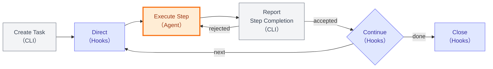

# Agentic Runtime

```mermaid
flowchart LR
  Create[Create Task<br>（CLI）] --> Direct[Direct<br>（Hooks）]
  Direct --> Execute[Execute Step<br>（Agent）]
  Execute --> Report[Report<br>Step Completion<br>（CLI）]
  Report -->|rejected| Execute
  Report -->|accepted| Continue{Continue<br>（Hooks）}
  Continue -->|next| Direct
  Continue -->|done| Close[Close<br>（Hooks）]

  classDef cli fill:#f3f4f6,stroke:#6b7280,color:#374151
  classDef hook fill:#e0e7ff,stroke:#6366f1,color:#3730a3
  classDef agent fill:#ffedd5,stroke:#f97316,color:#9a3412,stroke-width:3px

  class Create,Report cli
  class Direct,Continue,Close hook
  class Execute agent
```

Inspired by:
- [Loop Engineering](https://x.com/steipete/status/2063697162748260627?s=20)
- [Ralph Loop](https://ghuntley.com/ralph/)
